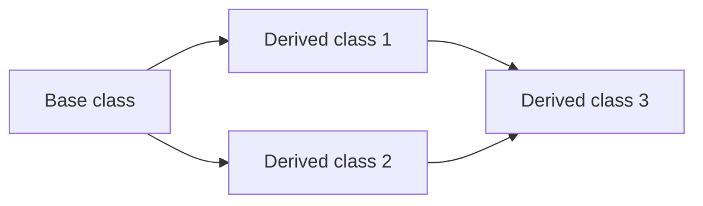

# Inheritance
## _Cpp-Inheritance_

[](https://www.bilibili.com/video/BV1et411b73Z?p=127)

> **_Keypoints_**
- Basic syntax
- Inheritance mode
- Inheritance object model
- Constructor and destructor sequence
- Same name of member variables and member functions in base class and derived class
- Multiple inheritance
- Rhombus inheritance and virtual inheritance

## Basic syntax
`class Son_class : inheritance_mode Base_class {`

```cpp
#include <iostream>
using namespace std;

// Put the same part of the two classes into the base class
class Base_class {
public:
    void header(){
        cout << "A B C D" << endl;
    }
    void footer(){
        cout << "1 2 3 4" << endl;
    }
}; 

// Put the different part of the two classes into the derived class
class Son_class : public Base_class {
public:
    void content(){
        cout << "B 2" << endl;
    }
};

class Daughter_class : public Base_class {
public:
    void content(){
        cout << "C 3" << endl;
    }
};

void test01(){
    cout << "------------------" << endl;
    Son_class son;
    son.header();
    son.content();
    son.footer();
    cout << "------------------" << endl;
    Daughter_class daughter;
    daughter.header();
    daughter.content();
    daughter.footer();
    cout << "------------------" << endl;
}

int main() {
    test01();
    return 0;
}
```

## Inheritance mode
- `inheritance_mode`:
  - `public`: public inheritance
  - `protected`: protected inheritance
  - `private`: private inheritance

[

### Public inheritance
- Public inheritance: public members of the base class become public members of the derived class, protected members of the base class become protected members of the derived class, and private members of the base class are not inherited by the derived class. The default inheritance mode is public inheritance.

### Protected inheritance
- Protected inheritance: public members and protected members of the base class become protected members of the derived class, and private members of the base class are not inherited by the derived class.

### Private inheritance
- Private inheritance: public members and protected members of the base class become private members of the derived class, and private members of the base class are not inherited by the derived class.

    ```cpp
    #include <iostream>
    using namespace std;

    class Base_class {
    public:
        int m_A;
    protected:
        int m_B;
    private:
        int m_C;
    };

    // Public inheritance
    class Son_class_1 : public Base_class {
    public:
        void func(){
            m_A = 10; // Public members of the base class become public members of the derived class
            m_B = 10; // Protected members of the base class become protected members of the derived class, accessible in the derived class
            // m_C = 10; // Private members of the base class are not inherited by the derived class
        }
    };

    // Protected inheritance
    class Son_class_2 : protected Base_class {
    public:
        void func(){
            m_A = 10; // Public members of the base class become protected members of the derived class
            m_B = 10; // Protected members of the base class become protected members of the derived class
            // m_C = 10; // Private members of the base class are not inherited by the derived class
        }
    };

    // Private inheritance
    class Son_class_3 : private Base_class {
    public:
        void func(){
            // m_A = 10; // Public members of the base class become private members of the derived class， not accessible
            // m_B = 10; // Protected members of the base class become private members of the derived class, not accessible
            // m_C = 10; // Private members of the base class are not inherited by the derived class
        }
    };

    test01(){
        Son_class_1 son1;
        son.m_A = 100; // Public 
        // son.m_B = 100; // Protected, not accessible in the main function
        // son.m_C = 100; // Private , not accessible in the main function

        Son_class_2 son2;
        // grandson.m_A = 100; // Protected
        // grandson.m_B = 100; // Protected
        // grandson.m_C = 100; // Private

        Son_class_3 son3;
        // grandgrandson.m_A = 100; // Private
        // grandgrandson.m_B = 100; // Private
        // grandgrandson.m_C = 100; // Private
    }

    int main() {
        test01();
        return 0;
    }
    ```

## Inheritance object model
- Inheritance object model: all non-static members of the base class are inherited by the derived class, including public members, protected members, and private members. The private members of the base class are not accessible in the derived class, but they do exist. The size of the derived class is at least as large as the size of the base class.
- Use development tools to view the object model of inheritance


## Constructor and destructor sequence
- Constructor and destructor sequence: the constructor of the base class is called before the constructor of the derived class, and the destructor of the derived class is called before the destructor of the base class.
  - i.e. Base constructor -> Derived constructor -> Derived destructor -> Base destructor

    ```cpp
    #include <iostream>
    using namespace std;

    class Base_class {
    public:
        Base_class(){
            cout << "Base constructor" << endl;
        }
        ~Base_class(){
            cout << "Base destructor" << endl;
        }
    };

    class Son_class : public Base_class {
    public:
        Son_class(){
            cout << "Derived constructor" << endl;
        }
        ~Son_class(){
            cout << "Derived destructor" << endl;
        }
    };

    void test01(){
        Son_class son;
    }

    int main() {
        test01();// Base constructor -> Derived constructor -> Derived destructor -> Base destructor
        return 0;
    }
    ```

## Same name of member variables and member functions in base class and derived class
- The member variables and member functions in the derived class will hide the member variables and member functions with the same name in the base class, and the member variables and member functions in the base class will be inaccessible in the derived class. Unless the base class member variables and member functions are called with the scope resolution operator.
- Syntax: `Derived variable name . Base class name :: member variable name`
    ```cpp
    #include <iostream>
    using namespace std;

    class Base_class {
    public:
        int m_A;
        void func(){
            cout << "Base class func" << endl;
        }
    };

    class Son_class : public Base_class {
    public:
        int m_A;
        void func(){
            cout << "Derived class func" << endl;
        }
    };

    void test01(){
        Son_class son;
        son.m_A = 100; // Derived class member variables
        son.Base_class::m_A = 200; // Base class member variables
        son.func(); // Derived class member functions
        son.Base_class::func(); // Base class member functions
    }

    int main() {
        test01();
        return 0;
    }
    ```

## Multiple inheritance
- Multiple inheritance: a derived class can have multiple base classes, and the syntax is as follows:
  - `class Derived class name: inheritance mode Base class name 1, inheritance mode Base class name 2...`
- There may be same name of member in multiple base classes. If the derived class calls the member, the compiler will report an error. This is called ambiguity.

```cpp
#include <iostream>
using namespace std;

class Base_class_1 {
public:
    Base_class_1(){
        m_A = 100; // constructor, to initialize the member variables
    }
    int m_A;
};

class Base_class_2 {
public:
    Base_class_2(){
        m_A = 200; // constructor, to initialize the member variables
    }
    int m_A;
};

class Son_class : public Base_class_1, public Base_class_2 {
public:
    Son_class(){
        m_C = 300; // constructor, to initialize the member variables
        m_D = 400;
    }
    int m_C;
    int m_D;
};

void test01(){
    Son_class son;
    cout << "son.m_A = " << son.m_A << endl; // Ambiguity, error!
    cout << "Base_class_1 son.m_A = " << son.Base_class_1::m_A << endl; // Specify the base class, 100
    cout << "Base_class_2 son.m_A = " << son.Base_class_2::m_A << endl; // Specify the base class, 200
    cout << "Occupation of son = " << sizeof(son) << endl; // 12, including two m_A, m_C, m_D
}

int main() {
    test01(); 
    return 0;
}
```


## Rhombus inheritance and virtual inheritance
- Rhombus inheritance: the base class has two derived classes, and the derived classes have a common base class. This is called rhombus inheritance.

- Rhombus inheritance will cause ambiguity of the base class, and the compiler will report an error. Because the base class has two copies in the derived class, the compiler does not know which copy to inherit.
- Virtual inheritance: the base class is inherited virtually, and the base class is only inherited once. This can solve the ambiguity of the base class.
  - Syntax: `class Derived class name: virtual inheritance mode Base class name`
  - The shared base class is inherited virtually, and the derived class will only have one copy of the base class. So, the value is determined by the last call.
  - Use virtual base pointer and virtual base table.

    ```cpp
    #include <iostream>
    using namespace std;

    class Base_class {
    public:
        int m_A;
    };

    class Derived_class_1 :virtual public Base_class {
    public:
        int m_B;
    };

    class Derived_class_2 :virtual public Base_class {
    public:
        int m_C;
    };

    class Derived_class_3 : public Derived_class_1, public Derived_class_2 {
    public:
        int m_D;
    };

    void test01(){
        Derived_class_3 son;
        // son.m_A = 100; // Ambiguity unless virtual inheritance, error!
        son.Derived_class_1::m_A = 100; // Specify the base class, m_A is shared by the two base classes
        son.Derived_class_2::m_A = 200; // Specify the base class
        cout << "son.Derived_class_1::m_A = " << son.Derived_class_1::m_A << endl; // 200
        cout << "son.Derived_class_2::m_A = " << son.Derived_class_2::m_A << endl; // 200
        cout << "son.m_A = " << son.m_A << endl; // 200
    }
    ```
